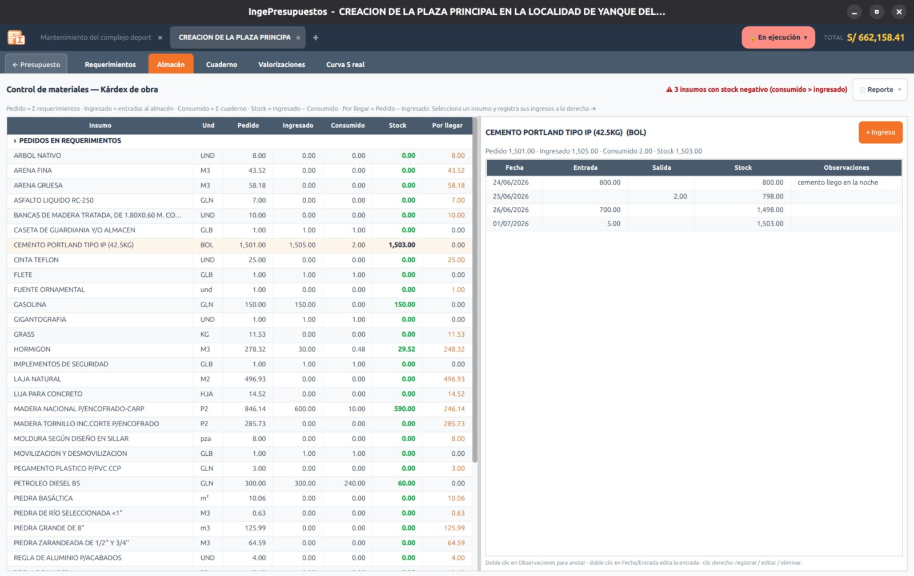

# Almacén (kárdex)

El **almacén** lleva el control de los **materiales** de la obra: cuánto pediste, cuánto llegó, cuánto se consumió y cuánto queda. Es un kárdex sencillo, pensado para obra —sin contabilidad ni proveedores—.

## Las columnas

Por cada material ves:

| Columna | Significado |
|---------|-------------|
| **Pedido** | Lo que solicitaste en los [Requerimientos](requerimientos.md). |
| **Ingresado** | Lo que ha entrado físicamente al almacén. |
| **Consumido** | Lo que se ha usado (viene del [Cuaderno de obra](cuaderno.md)). |
| **Stock** | Lo que queda disponible (ingresado − consumido). |
| **Por llegar** | Lo que falta que llegue (pedido − ingresado). |

El **stock negativo** se marca en **rojo**, para que detectes de inmediato un consumo sin respaldo de ingreso.

## Registrar ingresos

Con el botón **«+ Ingreso»** registras cada entrega: **fecha**, **cantidad** y una observación. Puedes registrar varias entregas de un mismo material.

A la derecha aparece el **kárdex por día** (Fecha · Entrada · Salida · Stock corrido). Las **salidas** vienen solas del cuaderno; los **ingresos** los registras tú. Con clic derecho puedes borrar un ingreso.

!!! note "Solo materiales"
    El almacén controla insumos de tipo **material**. La mano de obra y los equipos por hora no son de almacén (se controlan en el [Cuaderno de obra](cuaderno.md)).
