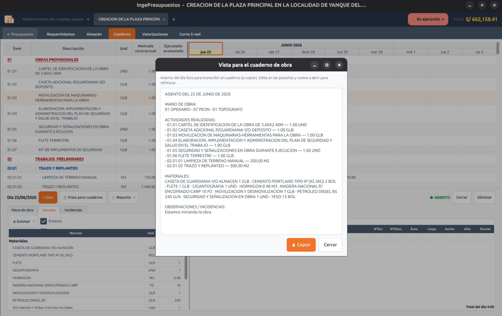

# Cuaderno de obra

El **cuaderno de obra** son los **asientos diarios** del residente: qué se ejecutó cada día, con qué recursos y qué incidencias hubo. Es el corazón del control de avance.

## El asiento del día

Por cada **día** registras:

- El **metrado ejecutado** por partida (solo editas la columna «Metr. del día»).
- La **mano de obra**, los **insumos** consumidos y las **observaciones** o incidencias.

La cabecera de la grilla agrupa los días por **mes** arriba y muestra el **día de la semana** abajo (`lun 25`, `mar 26`…). Un candado 🔒 indica un día cerrado.

## Estimar el consumo del día

Con el botón **«⤓ Estimar»** IngePresupuestos te propone el consumo de recursos del día, de dos maneras:

- **De los requerimientos** *(recomendado)* — toma solo los insumos de las partidas que trabajaste hoy, con la cantidad del día.
- **Del metrado** — una guía teórica según el ACU × el metrado ejecutado.

El interruptor **«Enteros»** redondea los materiales a unidades de pedido (bolsas, varillas…). Siempre puedes ajustar los números a mano.

## Se acumula hacia la valorización

Todo lo que registras en el cuaderno se **acumula automáticamente** hacia las **[Valorizaciones](valorizaciones.md)**: el metrado de los días que caen dentro del período de una valorización se suma solo. Los cambios se reflejan **al recargar** la pestaña de valorizaciones.

## Reporte por días

El reporte del cuaderno (PDF, Word u ODT) te deja **elegir los días** en un árbol **Año → Mes → Día**, para imprimir solo los asientos que necesites.
