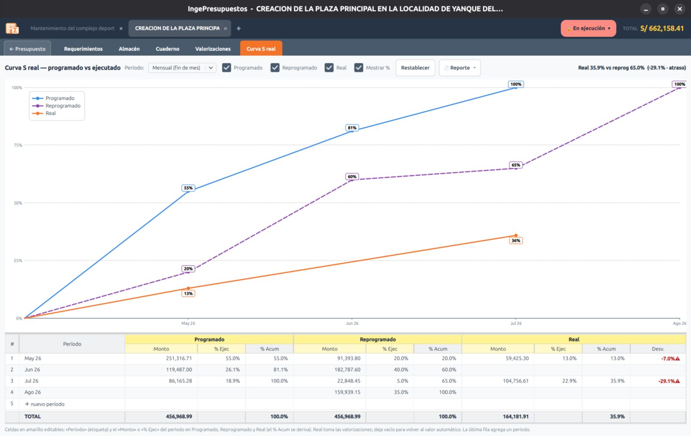

# Curva S real

La **Curva S real** compara, en un gráfico y una tabla, el avance **programado**, el **reprogramado** y el **real** de la obra. Así ves de un vistazo si vas adelantado o atrasado respecto a lo planificado.

## Las tres curvas

| Serie | Qué representa |
|-------|----------------|
| **Programado** | El avance previsto en tu planificación original. |
| **Reprogramado** | Tu replanificación, si tuviste que reajustar el plan. |
| **Real** | El avance efectivamente ejecutado (de las [valorizaciones](valorizaciones.md)). |

Las tres se miden contra el **mismo presupuesto contractual completo**, así que son directamente comparables. La curva arranca en el **inicio real de la obra**.

## Ajustes

- **Cortes de período:** por semana, por mes o a **fin de mes calendario** (el más habitual).
- **Reprogramación por período:** editas el **monto** o el **% ejecutado** de cada período; el acumulado se calcula solo. También puedes poner la etiqueta de cada período.
- **Real editable:** normalmente viene de las valorizaciones, pero puedes sobrescribirlo a mano.
- **Mostrar/ocultar** cada curva con sus interruptores; lo que ocultas se refleja igual en el reporte.

!!! tip "Estilos del gráfico"
    Con **clic derecho** sobre el gráfico puedes cambiar el color, el tipo de línea y el marcador de cada serie. Tus preferencias se recuerdan.

## Reporte

El reporte (PDF, Word u ODT) incluye el **gráfico** y la **tabla** de las tres series con su desviación.
