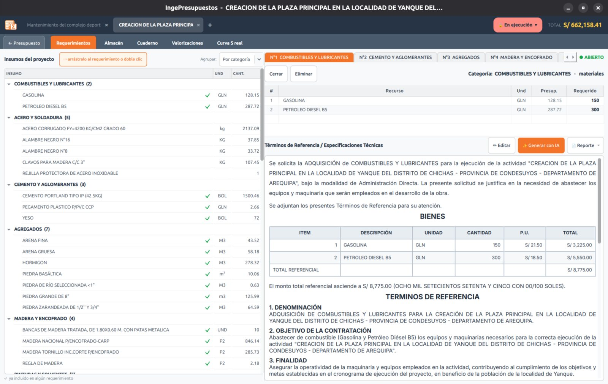

# Requerimientos

Los **requerimientos** son los pedidos de la obra: qué necesitas comprar y en qué cantidad. IngePresupuestos los arma **a partir de los insumos de tu presupuesto**, así no empiezas de cero.

## Cómo se arman

Los insumos se agrupan por **categoría** (materiales, combustibles, agregados, pinturas…). Para cada uno ves su **saldo pendiente** —lo que falta pedir según el presupuesto— y puedes ajustar la cantidad a solicitar.

Las cantidades se **redondean a unidades de pedido** reales:

- Cemento en **bolsas**, pintura en **galones**, etc.
- El **acero** se pide en **varillas de 9 m por diámetro**.

Puedes desactivar el redondeo si prefieres las cantidades exactas.

## Términos de Referencia con IA

Con un clic, la **IA redacta los Términos de Referencia / Especificaciones Técnicas** del requerimiento —listos para adjuntar a tu proceso de compra o exportar—. Es un borrador editable: revísalo y ajústalo a tu obra.

!!! tip "Los requerimientos alimentan el resto del módulo"
    Lo que pides aquí se usa después en el **[Almacén](almacen.md)** (columna *Pedido*) y sirve de guía para estimar el consumo en el **[Cuaderno de obra](cuaderno.md)**.
