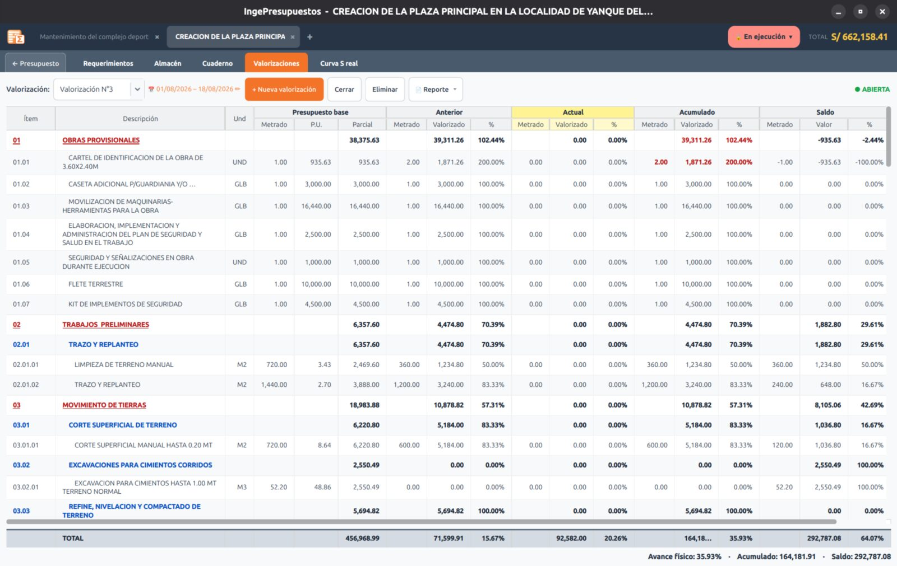

# Valorizaciones

Una **valorización** mide el **avance de la obra por partida** en un período, en el formato profesional que exige el expediente: **Base · Anterior · Actual · Acumulado · Saldo**, con su **porcentaje de avance físico**.

## Qué significa cada columna

| Columna | Qué mide |
|---------|----------|
| **Base** | El metrado y monto contractual (del presupuesto). |
| **Anterior** | Lo acumulado en las valorizaciones previas. |
| **Actual** | Lo ejecutado en este período. |
| **Acumulado** | Anterior + Actual. |
| **Saldo** | Lo que falta (Base − Acumulado). |

El único dato que registras es el **metrado ejecutado del período**; todo lo demás se **deriva solo**. Si el acumulado supera la base, esa fila se resalta en **rojo** para avisarte.

## De dónde sale el metrado

- Si hay **asientos en el [Cuaderno de obra](cuaderno.md)** dentro del período, el metrado se **calcula solo** (la celda queda de solo lectura, en azul).
- Si no, puedes escribir el metrado **a mano** (celda editable, en amarillo).

## El período

Cada valorización tiene un **período** (desde–hasta). Junto al selector verás el rango como un enlace **✏** para editarlo mientras la valorización esté **abierta**; al cambiarlo, el metrado del cuaderno se **vuelve a sincronizar** con las nuevas fechas.

!!! note "Abierta o cerrada"
    Una valorización **abierta** se puede editar; una **cerrada** queda fija. Solo puedes eliminar la **última** valorización mientras esté abierta.

## Reporte

El reporte (PDF, Excel u ODS) sale en formato horizontal con el cuadro Base/Anterior/Actual/Acumulado/Saldo y los subtotales por título.
