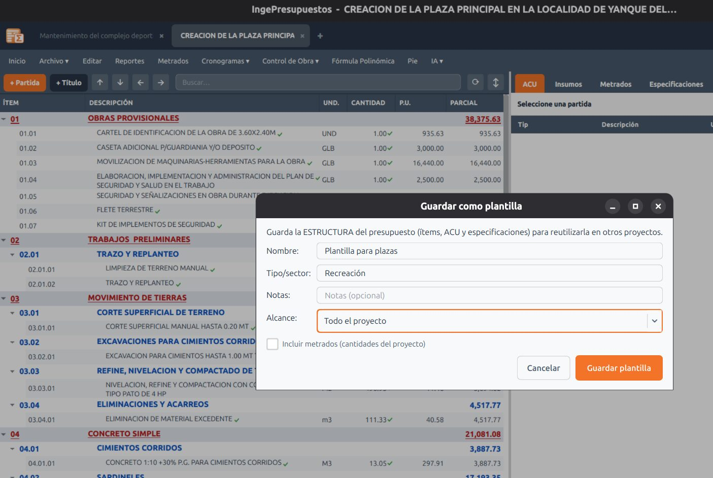

# Plantillas de estructura

Las **plantillas** te dejan **reutilizar el trabajo** entre proyectos. Elaboras un presupuesto al detalle una vez —por ejemplo un sistema de canales— y lo guardas como plantilla para no empezar de cero en el siguiente.

## Qué guarda una plantilla

Una plantilla conserva la **estructura de partidas** y su **análisis de costos (ACU)**, **sin los metrados** —porque esos cambian en cada obra—. Es tu conocimiento técnico, listo para volver a usar.

## Guardar e insertar

- **Guardar como plantilla:** desde **Archivo → Plantillas**, guardas el presupuesto completo (o un subpresupuesto) como una plantilla reutilizable. Se almacenan dentro de tu base de datos.
- **Insertar una plantilla:** en otro proyecto, insertas la plantilla con un clic y sigues trabajando sobre esa base.

## Compartirlas

Puedes **compartir una plantilla con tus colegas**: la exportas como archivo y ellos la importan. Así estandarizas criterios dentro de tu equipo.

!!! tip "Plantillas vs. Sugerir partidas"
    - Usa **[Sugerir partidas](sugerir-partidas.md)** cuando arrancas de cero y quieres que la IA proponga la estructura.
    - Usa **Plantillas** cuando ya tienes un presupuesto que quieres **volver a usar** tal cual.
