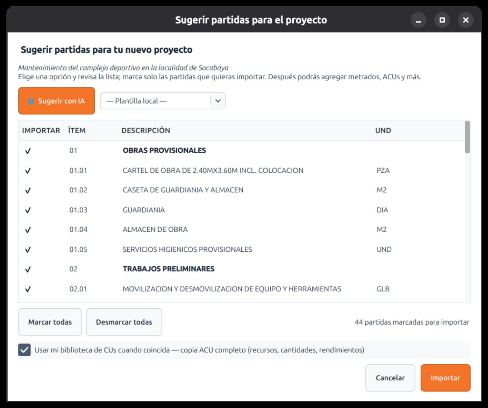

# Sugerir partidas con IA

¿Empiezas un presupuesto desde cero y no sabes por dónde arrancar? La función **Sugerir partidas** usa inteligencia artificial para **armar la estructura del presupuesto** a partir del **nombre del proyecto y unas notas**.

## La idea

La IA **arma la estructura** —los capítulos, las sub-partidas y su orden, según el tipo de obra—, pero los **costos los pone tu propia información**: tu biblioteca de ACU y tus proyectos anteriores. Así **no inventa precios**: te entrega un esqueleto ordenado y con criterio, listo para que lo ajustes.

## Cómo usarla

1. En un proyecto nuevo (o vacío), pulsa **Sugerir partidas** —está en el banner bajo el árbol de partidas y también en Tuxia—.
2. Escribe el **nombre del proyecto** y unas **notas** (tipo de obra, alcance, particularidades).
3. Elige el modo:
    - **Plantilla local** — estructuras predefinidas para varios tipos de obra (edificación, carretera, canal, losa deportiva, muro…). Funciona **sin internet**.
    - **Con IA** — la IA propone la estructura a la medida de tu descripción.
4. Revisa la propuesta y agrégala al proyecto. A partir de ahí trabajas normal: ajustas partidas, metrados y precios.

!!! note "La IA propone; tú decides"
    La sugerencia es un **punto de partida**, no una verdad absoluta. Revisa siempre las partidas, cantidades y precios antes de darlos por buenos.

!!! tip "¿Sin conexión?"
    Las **plantillas locales** no necesitan internet ni clave de IA. Para la sugerencia con IA sí hace falta una clave configurada (ver **[Tuxia](../tuxia.md)**).

Relacionado: guarda tu propio presupuesto como base reutilizable con las **[Plantillas de estructura](plantillas.md)**.
